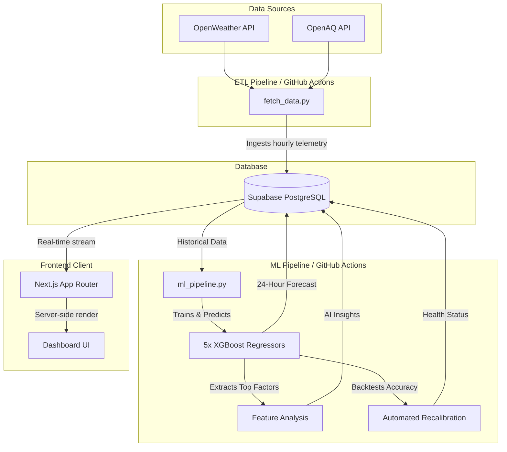
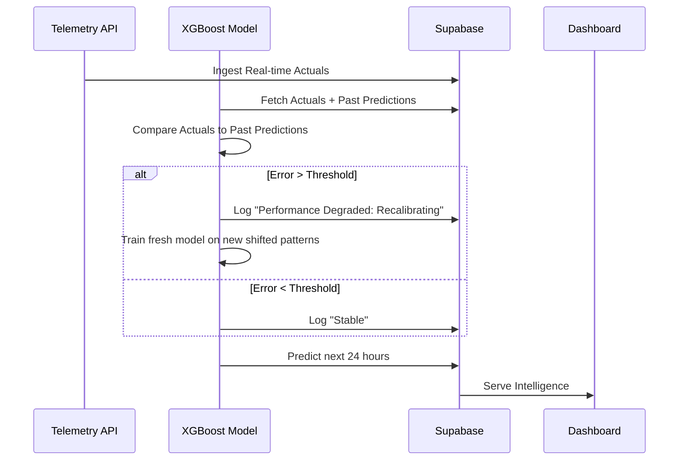

# 🌍 Smart City Intelligence Platform V2.0


**Cities generate massive amounts of environmental data, but most weather applications simply display forecasts without explaining them or improving from their mistakes. Smart City Intelligence Platform continuously predicts, evaluates, and refines urban environmental forecasts across five regions of Delhi through an automated ML pipeline.**

It actively ingests API telemetry, trains specialized models on-the-fly, and presents the intelligence on a frosted-glass interactive dashboard.

*(Insert 30-second Demo GIF here)*

---

## ✨ Features

- **Live Weather Intelligence:** Real-time data mapped to actionable insights.
- **Automated Retraining:** Models recalibrate dynamically based on their own error margins.
- **Explainable AI:** Feature importances are translated into natural language.
- **Time Travel UI:** Navigate backwards in time to view past predictions and environmental states.
- **Model Health Monitoring:** Track prediction accuracy over the last 24 hours.
- **Sustainability Score:** A real-time index punishing pollution and urban heat islands.

---

## 📈 System Metrics

- **5** City Zones Monitored
- **5** Specialized ML Models
- **1-Hour** Retraining Frequency
- **24-Hour** Forecasting Horizon
- **< 20 Seconds** End-to-End Pipeline Execution Time

---

## 🧠 Design Decisions

| Decision | Why |
| -------- | --- |
| **XGBoost over LSTM** | Better performance on structured tabular data with significantly lower training cost and latency. |
| **GitHub Actions over Airflow/Celery** | Simpler, serverless automation perfectly suited for a stateless ETL and retraining pipeline. |
| **Supabase over Raw Postgres** | Managed PostgreSQL with instant REST APIs, allowing seamless integration with Next.js Server Components. |
| **Hourly Retraining** | Balances model freshness with computational cost, correcting drift quickly without unnecessary overhead. |
| **Five Regional Models** | Captures localized micro-climate differences (e.g., Dwarka vs. Central Delhi) instead of washing out anomalies by averaging across the entire city. |
| **Tree Importances over SHAP** | Tree feature importances provide lightweight global explanations, avoiding the computational overhead of generating SHAP values during every retraining cycle. |

---

## 🏗 System Architecture

The platform operates through a decoupled architecture spanning data ingestion (ETL), predictive modeling (ML), and real-time visualization (Web). 



### 1. Data Ingestion (ETL)
Every hour, a GitHub Action triggers the ETL pipeline. It queries OpenWeather and OpenAQ for current meteorological and air quality metrics across 5 specific zones. This forms the foundational `environmental_data` table.

### 2. Machine Learning Engine
Following the ETL pipeline, the `ml_pipeline.py` script executes. It does **not** rely on a pre-trained, stale model. Instead, it:
1. Pulls the latest historical data from Supabase.
2. Resamples the data into strict 1-hour temporal blocks to normalize API intervals.
3. Trains **five distinct XGBoost MultiOutputRegressors**.
4. Predicts weather conditions 24 hours into the future.

### 3. Automated Model Recalibration (Continuous Adaptation)
Machine learning models drift. To combat this, the pipeline performs an automated **Backtest** every hour to verify if the previous predictions hold up.
1. It retrieves the prediction made 24 hours ago for the *current* timestamp.
2. It compares that prediction to the *actual* telemetry just received from the API.
3. If the error margin exceeds a safe threshold, the system logs an anomaly and automatically **recalibrates** by training fresh trees on the newly mutated data patterns.



---

## 🚧 Engineering Challenges

### API Interval Drift
OpenWeather and OpenAQ do not always return observations at perfectly regular intervals, leading to misaligned timestamps.
**Solution:** Resampled all telemetry into strict hourly windows (`resample('1h').mean().interpolate()`) before training to normalize row-shifts and ensure temporal accuracy.

### Data Sparsity
Certain environmental metrics (like cloud cover or PM2.5 from specific stations) occasionally disappear from the API payloads.
**Solution:** Implemented linear interpolation and robust default fallbacks before feature engineering, preventing catastrophic training failures during sensor downtime.

### Cold Start
Early versions lacked sufficient historical context to train an accurate 24-hour forecaster.
**Solution:** Designed the automated retraining pipeline to continuously adapt and improve forecasting quality automatically as additional telemetry accumulates in the database over time.

---

## 📂 Repository Structure

```text
smart-city-predictor/
├── web/                    # Next.js frontend application
│   ├── src/
│   │   ├── app/            # Next.js App Router (page.tsx, layout.tsx)
│   │   └── components/     # React UI components (Dashboard.tsx)
│   └── public/             # Static assets (images, icons)
├── fetch_data.py           # ETL pipeline script
├── ml_pipeline.py          # Machine learning pipeline script
├── backfill_columns.py     # Database schema migration script
├── requirements.txt        # Python dependencies
└── .github/workflows/      # CI/CD & Automation
    ├── fetch_data.yml      # Hourly ETL cron job
    └── run_ml.yml          # Hourly ML pipeline cron job
```

---

## 🚀 Getting Started

### Prerequisites
- Node.js 18+
- Python 3.11+
- Supabase Project

### Environment Variables
Create a `.env.local` in the `/web` folder and a `.env` in the root folder:
```env
SUPABASE_URL=your_supabase_url
SUPABASE_KEY=your_supabase_anon_key
OPENWEATHER_API_KEY=your_openweather_key
OPENAQ_API_KEY=your_openaq_key
```

### Run Locally
**Frontend:**
```bash
cd web
npm install
npm run dev
```

**Manual Pipeline Trigger:**
```bash
pip install -r requirements.txt
python3 fetch_data.py
python3 ml_pipeline.py
```
