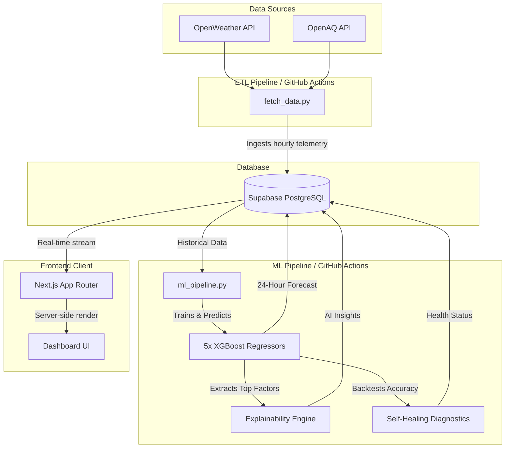
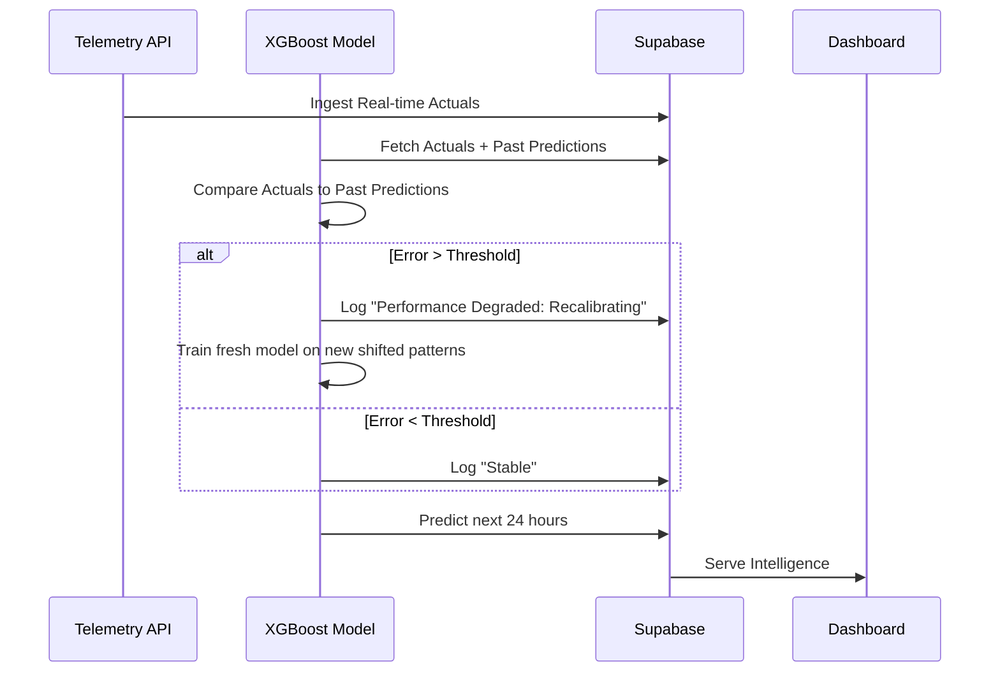

# 🌍 Smart City Intelligence Platform V2.0


The **Smart City Intelligence Platform** is an autonomous, self-healing machine learning system designed to predict and diagnose urban micro-climates in real-time. It actively ingests environmental telemetry across 5 distinct city zones, trains specialized AI models on-the-fly, and presents the intelligence on a frosted-glass interactive dashboard.

---

## 🏗 System Architecture

The platform operates autonomously through a decoupled architecture spanning data ingestion (ETL), predictive modeling (ML), and real-time visualization (Web).



### 1. Data Ingestion (ETL)
Every hour, a GitHub Action triggers the ETL pipeline. It queries OpenWeather and OpenAQ for current meteorological and air quality metrics across 5 specific zones (e.g., Central Delhi, Dwarka, Rohini). This forms our foundational `environmental_data` table.

### 2. Machine Learning Engine
Following the ETL pipeline, the `ml_pipeline.py` script executes. It does **not** rely on a pre-trained, stale model. Instead, it:
1. Pulls the latest historical data from Supabase.
2. Resamples the data into strict 1-hour temporal blocks to normalize API intervals.
3. Trains **five distinct XGBoost MultiOutputRegressors**, one tailored to the specific micro-climate of each zone.
4. Predicts weather conditions 24 hours into the future.

#### Why XGBoost?
We selected XGBoost over Deep Learning models (like LSTMs) because:
- **Tabular Superiority:** Gradient boosted trees notoriously outperform neural networks on small-to-medium tabular datasets.
- **Explainability:** Tree-based models allow for instantaneous extraction of feature importances, completely eliminating the need for expensive post-hoc SHAP calculations.
- **Speed:** The entire pipeline (fetching, training 5 models, forecasting, and backtesting) executes in under 20 seconds on a standard GitHub Action runner.

### 3. The Explainability Engine (AI Insights)
Black-box AI is dangerous in smart city infrastructure. To solve this, the pipeline extracts the mathematical Feature Importances from the XGBoost trees instantly after training. 

By analyzing which nodes split the most, the AI determines the exact "Top Driving Factors" for the current forecast. The UI then translates this (e.g., `['Humidity', 'Wind Speed']`) into a human-readable live intelligence brief: 
> *"Current wind patterns are effectively dispersing airborne particulates."*

### 4. Self-Healing Diagnostics & Failure Recovery
Machine learning models drift. To combat this, the pipeline performs an autonomous **Backtest** every hour.
1. It looks at the prediction it made 24 hours ago for the *current* timestamp.
2. It compares that prediction to the *actual* telemetry we just received from the API.
3. If the error margin exceeds a safe threshold (e.g., a sudden unexpected weather shift), the system logs an anomaly status and automatically **recalibrates** by training fresh trees on the newly mutated data patterns.



---

## 📊 Key Performance Indicators (KPIs)

The frontend is built in React / Next.js and visualizes intelligence via strategic KPIs:

- **Sustainability Score (0-100):** A custom composite metric. It penalizes the city for extreme PM2.5 pollution levels and extreme temperature anomalies (urban heat islands). A high score indicates a clean, thermally balanced environment.
- **Model Accuracy Ring:** A dynamic SVG ring that plots the exact percentage of accuracy achieved by the AI during its most recent 24-hour backtest.
- **Time Travel:** Because we store the complete lineage of historical actuals and AI predictions, the dashboard URL accepts a `?date=` parameter, allowing users to scroll back in time and view the exact state of the intelligence platform before past weather events occurred.

---

## 🚀 Getting Started

### Prerequisites
- Node.js 18+
- Python 3.11+
- Supabase Project

### Environment Variables
Create a `.env.local` in the `/web` folder and a `.env` in the root folder:
```env
SUPABASE_URL=your_supabase_url
SUPABASE_KEY=your_supabase_anon_key
OPENWEATHER_API_KEY=your_openweather_key
OPENAQ_API_KEY=your_openaq_key
```

### Run Locally
**Frontend:**
```bash
cd web
npm install
npm run dev
```

**Manual Pipeline Trigger:**
```bash
pip install -r requirements.txt
python3 fetch_data.py
python3 ml_pipeline.py
```
